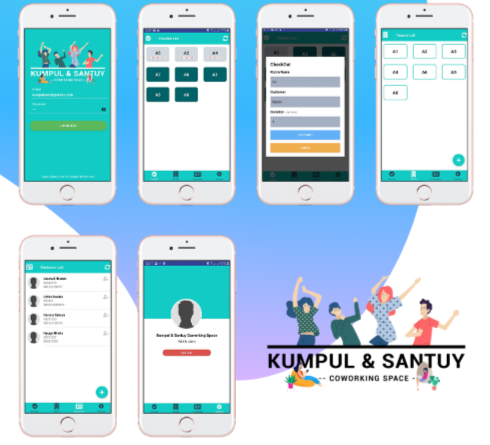

<h1 align="center">
   
</h1>

## Important

This project is still on very early development stage. If you want to use for production, use it with your own risk.
 More feature Coming Really Soon.

## What is Kumpul Santuy ?

Admin management room application for Coworking Space, which functions for managing room data, customer data, and rental management such as checkin and checkout functions for admins.

## Screenshots

  

## Features

- Managing Room data
- Managing Customer data
- Checkin & Checkout
- Auto Checkout
- RealTime countdown view

## Tech Stack

- React Native for the Mobile Frontend
- Express JS for BackEnd

## Support Me :)

- Star this repository :
- Hire Me https://bit.ly/izzalinked

## Contact

- WA/TELEGRAM: +62 822 6091 1152
- email: izzasrv@gmail.com
